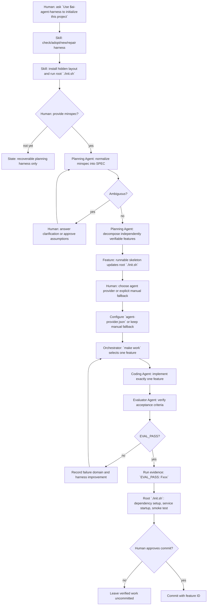

# New Project Flow

This is the end-to-end path for starting a new project with the AI Agent Harness skill.



## What The Skill Does

- Installs or repairs the harness without relying on chat history.
- Defaults new projects to hidden layout: root keeps thin `AGENTS.md` and `init.sh`; harness state lives under `.agent-harness/`.
- Keeps durable state in repository files: `SPEC.md`, `feature_list.json`, `progress.md`, `docs/`, `QUALITY.md`, and `runs/`.
- Runs the startup protocol and root `./init.sh` before planning, coding, evaluation, continuation, or commit.
- Routes vague requirements through spec normalization before feature entries exist.
- Splits broad requirements into independently verifiable features.
- Requires the first post-minspec project feature to make root `./init.sh` a real project recovery contract.
- Uses `make work` as the default one-feature implementation and evaluation entrypoint.
- Requires evaluator pass evidence before a feature can be complete.

## What Humans Must Provide

- Project intent: new install, adopt existing project, repair existing harness, or check only.
- Conflict decisions: whether the skill may overwrite merge-sensitive files; default is no.
- Minspec: the smallest useful project description, including goal, included scope, excluded scope, core flows, constraints, and verification expectations.
- Clarifications: answers or approved assumptions when the minspec is ambiguous.
- Runtime choices: language, framework, dependency manager, service command, endpoint or core function for smoke testing.
- Agent provider choice: Codex, Claude Code, Cursor Agent, or custom provider, configured through `agent-provider.json` before real `make work`.
- Execution approval: whether to run real orchestrated agent work or stay in preview/manual fallback.
- Commit approval: explicit approval before staging and committing verified work.

## First Commands

Installed skill invocation:

```text
Use $ai-agent-harness to initialize this project.
```

Manual fallback from a repository checkout:

```bash
python3 skills/ai-agent-harness/scripts/init_harness.py --root /path/to/project --mode adopt
```

Preview one orchestrator round:

```bash
make dry-run
```

Run one real orchestrator round after provider configuration:

```bash
make work
```

## Required Follow-On Decisions

Before a minspec exists, root `./init.sh` may only prove that the harness is runnable. After a minspec is accepted, the first project setup feature must turn root `./init.sh` into the recovery contract:

- install or verify dependencies;
- start required services itself;
- run at least one endpoint or core-function smoke test;
- print clear logs;
- exit non-zero on failure.

Provider setup is explicit. Copy `agent-provider.example.json` to `agent-provider.json`, choose one provider, and verify the provider command before real execution. Do not guess between installed CLIs.

## Related Rules

- `docs/spec-normalization.md` for minspec-to-SPEC requirements.
- `docs/feature-decomposition.md` for feature splitting.
- `docs/project-recovery-init.md` for root `./init.sh` requirements.
- `docs/agent-provider-configuration.md` for Codex, Claude Code, Cursor Agent, and custom providers.
- `docs/evaluator-evidence.md` for `EVAL_PASS: Fxxx` run evidence.
- `docs/commit-messages.md` for approved feature commits.
