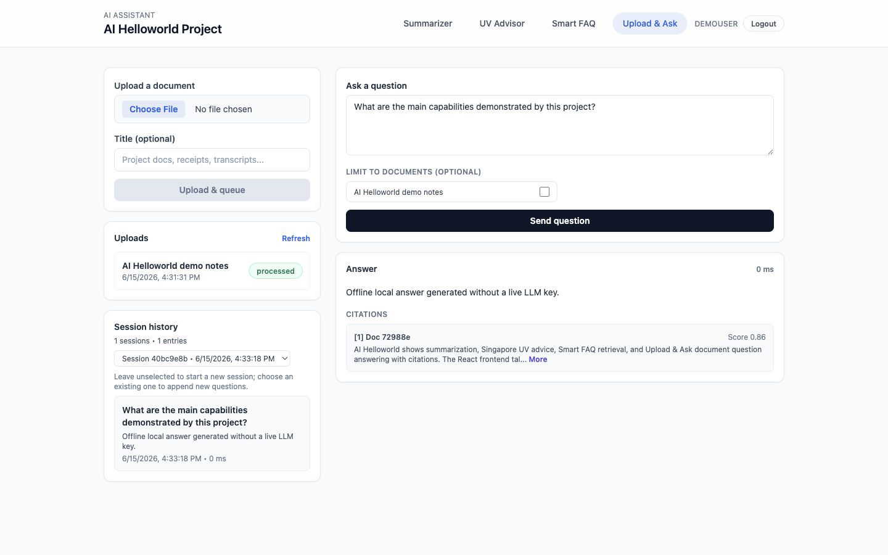
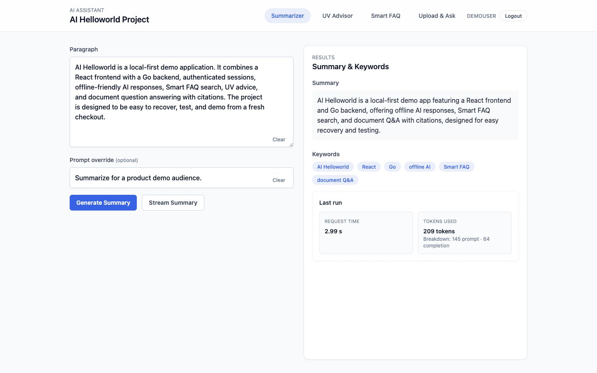
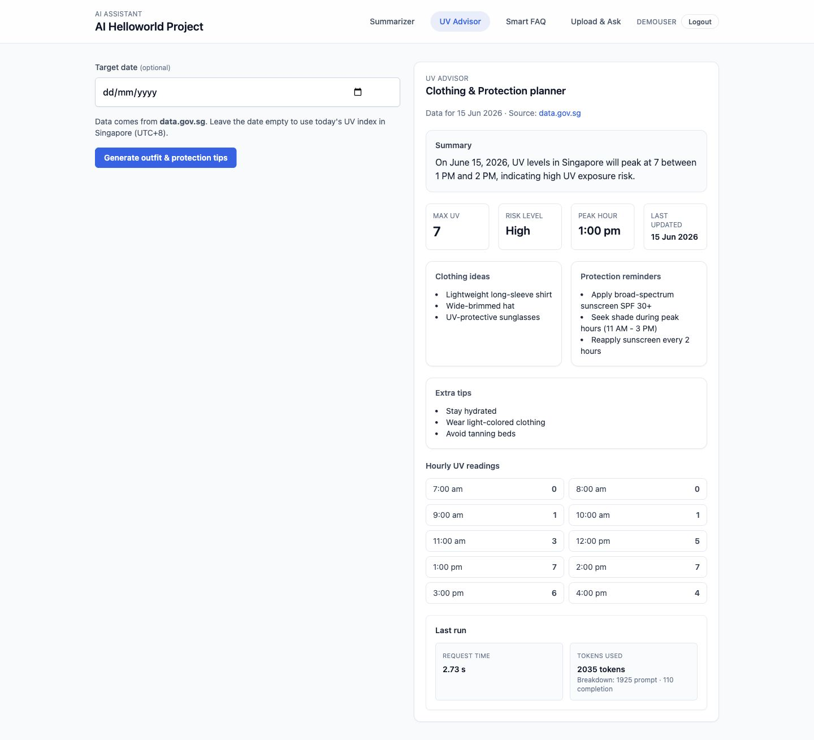
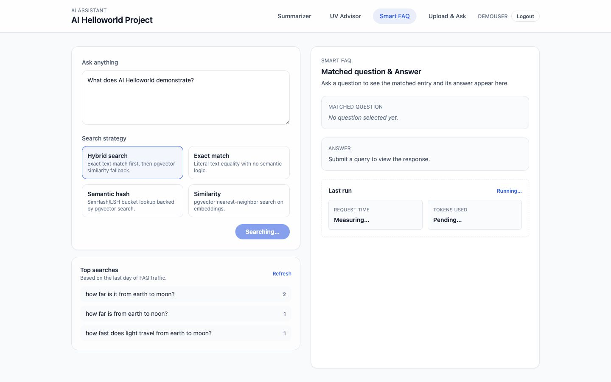
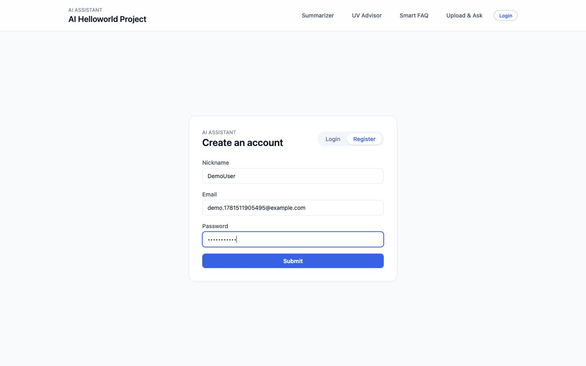
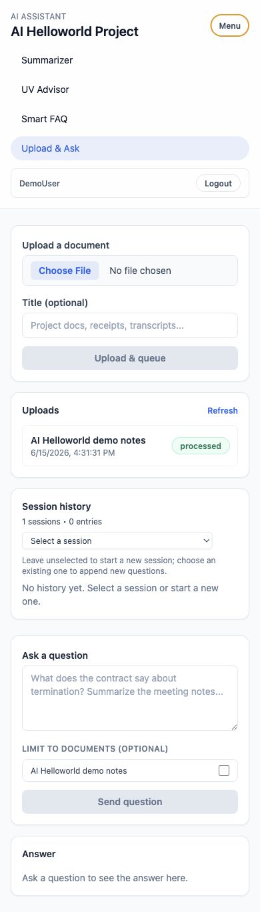

# AI Helloworld Demo

AI Helloworld is a React frontend backed by the sibling Go service at
`/Users/armstrong/Project/ai-helloworld`. The demo should show the product as a
small authenticated AI workspace: users sign in, run focused AI tools, and ask
questions over uploaded documents with cited answers.

## Demo Story

1. A user signs in or registers with email, password, and a short nickname.
2. The app stores access and refresh tokens locally, then opens the protected
   dashboard.
3. The user can choose one of four tools:
   - Summarizer: turn long text into a concise summary and keywords.
   - UV Advisor: fetch Singapore UV data and generate protection guidance.
   - Smart FAQ: search cached and AI-backed answers with recommendations.
   - Upload & Ask: upload documents, ask follow-up questions, and inspect
     citation-linked answers plus session history.

## Screenshot Set

Store screenshots in `docs/assets/screenshots/`. Use realistic demo data and
avoid showing real emails, tokens, API keys, private documents, or internal
customer data.

| File | Route | Purpose |
| --- | --- | --- |
| `login.png` | `/login` | Shows account entry, registration, and Google OAuth entry point. |
| `summarizer.png` | `/` | Shows the base AI summarization flow, prompt override, keywords, and request stats. |
| `uv-advisor.png` | `/uv-advisor` | Shows external data plus AI-generated clothing and protection advice. |
| `smart-faq.png` | `/smart-faq` | Shows FAQ search modes, cached answers, and recommendation signals. |
| `upload-ask.png` | `/upload-ask` | Main hero screenshot: document upload, question, answer, citations, latency, and history. |
| `mobile-nav.png` | Any protected route at mobile width | Shows the responsive navigation and authenticated user state. |

## Screenshot Gallery

### Upload & Ask

### Summarizer

### UV Advisor

### Smart FAQ

### Authentication

### Mobile Navigation

## README Placement

The README uses `upload-ask.png` as the primary screenshot because it communicates
the most complete product loop: authenticated document upload, retrieval,
answering, citations, and persisted conversation history.

If more visual detail is needed, keep it in this document rather than expanding
the README.

## Suggested Walkthrough Copy

### Upload & Ask

Upload & Ask is the best first screenshot. A user uploads a document, asks a
question, and receives a cited answer. The UI keeps the current answer visible
while also refreshing the session list and history, so the page demonstrates the
frontend/backend contract clearly.

### Summarizer

The Summarizer page demonstrates the simplest AI request. It accepts long text,
preserves the backend response format, and displays both the summary and
keywords. Use this screenshot to show the baseline interaction pattern shared by
the other tools.

### UV Advisor

The UV Advisor page shows that the backend can combine live external data with
LLM output. A good screenshot should include the UV category, peak hour,
clothing advice, protection guidance, and source timestamp.

### Smart FAQ

Smart FAQ shows the cache/retrieval side of the project. Capture a query that
returns a matched question, answer source, search mode, and recommendations so
users can see that repeat questions become easier to answer.

### Auth

The Auth screen should be a supporting screenshot, not the headline. It proves
the app has protected routes, token-backed sessions, refresh support, and an
optional Google OAuth callback flow.

## Capture Checklist

- Use a demo account such as `demo@example.com` and a harmless nickname such as
  `DemoUser`.
- Keep the browser width consistent for desktop screenshots, for example
  `1440x900`.
- Capture one mobile screenshot around `390x844` to prove the navigation works.
- Prefer seeded or deterministic local data when possible so screenshots can be
  refreshed later.
- If using real LLM responses, review the output for private or surprising
  content before committing images.
- Compress PNG files before committing if they are large.

## Backend Context

The frontend calls the Go backend through `/api/v1/...` routes. Local
development uses the Vite proxy to reach `http://localhost:8080`, while hosted
builds use `VITE_API_BASE_URL`.

The backend README should stay API-focused. Link from the backend README to this
frontend demo if a cross-repository product entry is needed, but keep the
screenshots in the frontend repository.
